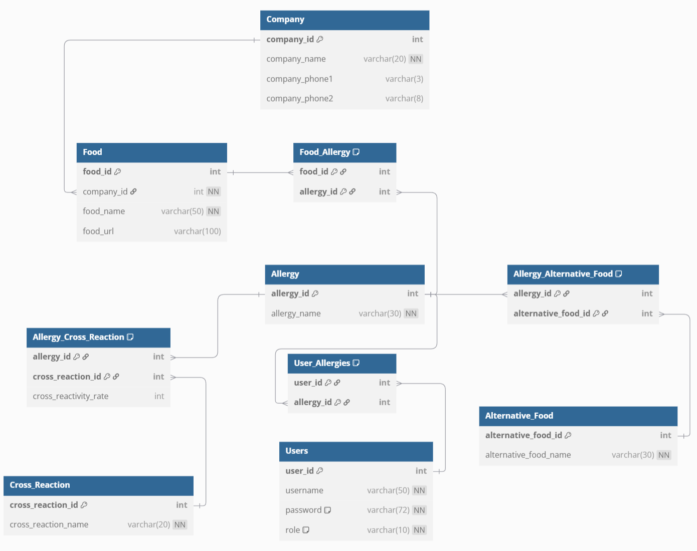

# 🥜 웹 크롤링 기반 개인 맞춤형 식품 알레르기 정보 시스템

제조사 웹사이트에 흩어져 있는 식품 알레르기 정보를 **웹 크롤링 + OCR**로 수집해 관계형 데이터베이스로 통합하고, 제품명 검색만으로 **알레르기 유발 성분 · 대체 식품 · 교차반응군**을 한 번에 확인할 수 있는 시스템입니다.

로그인한 사용자에게는 등록해 둔 본인의 알레르기 정보와 대조해 **개인 맞춤형 경고**를 제공합니다.

> 2025-1 데이터베이스 기말 프로젝트 (개인)
>
> 🔗 **후속 프로젝트**: 이 시스템을 기반으로 YOLO v8 이미지 인식과 Gemini LLM을 결합해 웹 서비스로 확장한 [AllerCheck (python_deeplearning_project)](https://github.com/cajsf/python_deeplearning_project)

## 주요 기능

**식품 정보 조회**
- 제품명 검색 → 알레르기 유발 성분 + 대체 식품 + 교차반응군(반응률 %) 종합 제공
- 제품·알레르기 정보 추가/수정/삭제 (CRUD)

**사용자 기능**
- 회원가입 / 로그인 (bcrypt 비밀번호 해싱)
- 개인 알레르기 정보 등록·관리
- 🔔 **개인 맞춤 알림** — 검색한 식품에 내 알레르기 유발 성분이 포함되면 즉시 경고
- 비밀번호 확인을 통한 안전한 회원 탈퇴

**관리자 기능**
- 역할(role) 기반 접근 제어
- 전체 사용자 목록 조회
- 사용자 등록 데이터 기반 알레르기 순위 통계 (TOP 5)

## 데이터 수집

[`웹크롤링_오뚜기.ipynb`](웹크롤링_오뚜기.ipynb) — 상용 데이터 없이 **오뚜기몰 전체 카테고리 제품 약 1,152개**를 직접 크롤링해서 구축했습니다.

- 제품명·상세 페이지 URL·알레르기 유발 물질 정보 수집 → [`오뚜기_제품_정보.csv`](오뚜기_제품_정보.csv)
- 상세 페이지의 알레르기 표기가 **이미지로만 제공**되어 Tesseract OCR로 텍스트 추출
- 정규표현식으로 제품명의 홍보 문구(`[행사]`, `(증정)` 등) 제거 후 적재

### 기술적 도전과 해결

| 문제 | 해결 |
|---|---|
| 제품 목록이 초기 HTML에 없고 스크롤 시 비동기 로드(AJAX)됨 | 개발자 도구로 네트워크 요청을 분석해 실제 데이터를 반환하는 `product_list.ajax` 엔드포인트를 찾아 POST 요청으로 전체 목록 수집. `requests.Session()`으로 세션 유지 |
| 핵심 정보인 알레르기 목록이 텍스트가 아닌 **이미지 안에** 존재 | 상세 이미지를 다운로드해 pytesseract로 텍스트 추출 후, 사전 정의한 알레르기 사전(`allergy_dict`)과 대조해 성분 식별 |
| OCR 엔진의 이미지 크기 제한으로 대형 이미지 처리 실패 | 크기 초과 시 정보가 있는 하단 영역만 잘라 처리하는 `ocr_with_size_check` 함수 구현 |
| Tesseract의 한글 인식률 한계 | PaddleOCR 도입을 시도했으나 CUDA·cuDNN 버전 호환성 문제로 실패 → 안정성이 검증된 Tesseract 유지. 신기술 도입 시 의존성 관리의 중요성을 체감 |
| 크롤링으로 인한 대상 서버 부하 | 요청마다 1~10초 랜덤 지연(`time.sleep(random.uniform(1, 10))`) 적용 |

## 데이터베이스 설계



- **10개 테이블**: Company, Food, Allergy, Alternative_Food, Cross_Reaction, Users + 연결 테이블 4개
- 다대다 관계(식품↔알레르기, 알레르기↔대체식품, 알레르기↔교차반응군, 사용자↔알레르기)를 연결 테이블로 해소하여 **제3정규형(3NF)** 만족
- 연결 테이블은 두 부모의 FK를 조합한 **복합 기본키**로 관계 중복 방지, `username`은 UNIQUE 제약
- 모든 FK에 `ON DELETE CASCADE` 적용 — 사용자 삭제 시 등록된 알레르기 정보가 자동 삭제되어 고아 데이터 방지
- bcrypt 해시가 60자 고정 길이임을 고려해 `password` 컬럼을 `VARCHAR(72)`로 설계

<details>
<summary>알레르기 교차반응군 참고 자료</summary>


</details>

## 프로젝트 구조

```
├── food_allergy_app/        # CLI 애플리케이션
│   ├── main.py              #   메뉴 UI 및 흐름 제어
│   └── queries.py           #   PyMySQL 기반 DB 쿼리 계층
├── SQL/                     # 초기 데이터 (알레르기·대체식품·교차반응군 등)
├── 데이터베이스.ipynb          # DB·테이블 생성 및 데이터 적재
├── 웹크롤링_오뚜기.ipynb        # 제품 정보 크롤링 (+OCR)
├── ERD.png / ERD_code.txt   # ERD 다이어그램
├── 메뉴얼.txt                # 상세 실행 매뉴얼
└── 보고서_발표자료/            # 최종 보고서(PDF)·발표자료(PPT)
```

## 실행 방법

**요구 환경**: Python 3.10+, MySQL 8.0+, Tesseract-OCR(데이터 수집 시)

```bash
pip install -r requirements.txt
```

1. [`데이터베이스.ipynb`](데이터베이스.ipynb)를 순서대로 실행해 DB·테이블 생성 및 데이터 적재
2. `food_allergy_app/main.py` 실행 → 회원가입 후 사용
3. 관리자 기능은 `admin` 계정 생성 후 노트북 마지막의 관리자 설정 코드 실행

자세한 절차(샘플 사용자·관리자 계정 설정 등)는 [메뉴얼.txt](메뉴얼.txt)를 참고하세요.

## 향후 개선 방향

- **데이터 소스 확대·자동화** — CJ, 풀무원 등 타 제조사로 수집 범위를 넓히고, 주기적 크롤링 스케줄링으로 최신성 유지
- **GUI 제공** — 콘솔 기반 인터페이스를 웹/모바일 앱으로 확장
- **OCR 고도화** — 환경 문제로 보류한 PaddleOCR을 재도입해 한글 인식 정확도 개선
- **사용자 편의 기능** — 최근 검색 기록, 인기 검색 제품 추천 등

## 문서

- 📄 [최종 보고서 (PDF)](보고서_발표자료/데이터베이스_기말_프로젝트_보고서.pdf)
- 📊 [발표자료 (PPTX)](보고서_발표자료/데이터베이스_기말_프로젝트_발표자료.pptx)
